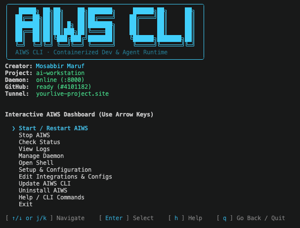

<p align="center">
  
</p>

<h1 align="center">AIWS</h1>

---

<p align="center">
  <strong>A secure and reusable development workstation for VPS, with isolated Docker projects, DeepSeek Harness, GitHub App authentication, SSH previews, and simple lifecycle management.</strong>
  <br />
  <em>Looking for the web console? Check out the <a href="https://github.com/mosabbir-maruf/aiws">AIWS Web Interface</a>.</em>
</p>

<p align="center">
  <a href="https://github.com/mosabbir-maruf/ai-workstation-cli/actions/workflows/image.yml"></a>
  <a href="https://github.com/mosabbir-maruf/ai-workstation-cli/pkgs/container/aiws-cli"></a>
  <a href="https://github.com/mosabbir-maruf/ai-workstation-cli"></a>
  <a href="https://www.docker.com/"></a>
  <a href="https://github.com/deepseek-ai/deepseek-harness"></a>
  <a href="LICENSE"></a>
  <a href="CONTRIBUTING.md"></a>
  <a href="SECURITY.md"></a>
  <a href="https://github.com/mosabbir-maruf"></a>
</p>

<p align="center">
  
</p>

---

## Table of Contents

- [Overview](#overview)
- [Architecture](#architecture)
- [Security Model](#security-model)
- [Repository Structure](#repository-structure)
- [Host Runtime Structure](#host-runtime-structure)
- [Requirements](#requirements)
- [Clone the Repository](#clone-the-repository)
- [Installation](#installation)
- [Configuration](#configuration)
- [GitHub Authentication](#github-authentication)
- [Daily Workflow](#daily-workflow)
- [CLI Reference](#cli-reference)
- [Project Lifecycle](#project-lifecycle)
- [Harness and DSH Lifecycle](#harness-and-dsh-lifecycle)
- [Preview and SSH Tunneling](#preview-and-ssh-tunneling)
- [Anywhere Access via Cloudflare Tunnel](#anywhere-access-via-cloudflare-tunnel)
- [Git Workflow](#git-workflow)
- [Cache Management](#cache-management)
- [State Backup and Recovery](#state-backup-and-recovery)
- [Updates and Upgrades](#updates-and-upgrades)
- [CI/CD](#cicd)
- [Operational Runbook](#operational-runbook)
- [Troubleshooting](#troubleshooting)
- [Security Checklist](#security-checklist)
- [Design Decisions](#design-decisions)
- [Quick Reference](#quick-reference)
- [Contributing](#contributing)
- [Security](#security)
- [License](#license)
- [Maintainer](#maintainer)

---

## Overview

AIWS provides one reusable development environment on a remote Linux VPS.

Projects remain ordinary Git repositories on the host under `~/projects/`. Only the currently selected project is mounted into the workstation container at `/workspace`.

The workstation contains the common developer runtime and DeepSeek Harness. DSH installation and DSH state are persisted outside the disposable container filesystem, allowing the container/image to be replaced without intentionally losing Harness state.

The system has four major boundaries:

1. **Host management layer** — Docker, projects, runtime state, secrets, and the `aiws` CLI.
2. **Workstation container** — isolated developer runtime plus the selected project.
3. **GitHub broker** — GitHub App credential flow through a Unix socket instead of a PAT or host SSH key inside the container.
4. **Existing infrastructure** — the existing gateway/reverse-proxy stack remains separate.

---

## Architecture

### High-level architecture

```text
                                  INTERNET
                                      │
                       ┌──────────────┴──────────────┐
                       │                             │
                  SSH :1182                      HTTPS :443
                       │                             │
                       ▼                             ▼
                ┌────────────┐             ┌─────────────────────┐
                │ Mac / Admin│             │ Existing Reverse    │
                │   Client   │             │ Proxy / Nginx       │
                └─────┬──────┘             └──────────┬──────────┘
                      │                               │
                SSH tunnel                            ▼
                      │                      Existing application stack
                      ▼
┌────────────────────────────────────────────────────────────────────────────┐
│                            Ubuntu VPS / Host                               │
│                                                                            │
│  ┌──────────────────────┐       ┌───────────────────────────────────────┐  │
│  │ ~/projects/          │       │ ~/aiws-cli/                 │  │
│  │                      │       │                                       │  │
│  │ project-a/           │       │ scripts/aiws                            │  │
│  │ project-b/           │       │ docker/                               │  │
│  │ active-project/ ─────┼──────►│ runtime/                              │  │
│  │                      │       │ secrets/                              │  │
│  └──────────┬───────────┘       │ .env                                  │  │
│             │                   └────────────────┬──────────────────────┘  │
│             │                                    │                         │
│             │ /workspace mount                   │ Docker Compose          │
│             ▼                                    ▼                         │
│  ┌──────────────────────────────────────────────────────────────────────┐  │
│  │                          aiws-cli                          │  │
│  │                                                                      │  │
│  │  User: sandbox (UID 1001)                                            │  │
│  │  Node.js + Git + SSH client + ripgrep + fd + procps + tini           │  │
│  │                                                                      │  │
│  │  /workspace                  ← active project only                   │  │
│  │  /home/sandbox/.dsh          ← persistent DSH state                  │  │
│  │  /home/sandbox/.npm-global   ← persistent DSH installation           │  │
│  │                                                                      │  │
│  │  DSH:     127.0.0.1:4090                                             │  │
│  │  Bridge:  0.0.0.0:4091                                               │  │
│  │  App:     project-selected development port(s)                       │  │
│  └──────────────────────────────────────────────────────────────────────┘  │
│                              ▲                                             │
│                              │ Unix socket                                 │
│                   ┌──────────┴───────────┐                                 │
│                   │ GitHub broker runtime│                                 │
│                   │ github.sock          │                                 │
│                   └──────────┬───────────┘                                 │
│                              │                                             │
│                   GitHub App private key                                   │
│                              │                                             │
│                   secrets/github-app.pem                                   │
└────────────────────────────────────────────────────────────────────────────┘
```

### Data flow

```text
Mac / operator
     │
     │ SSH
     ▼
Host CLI: aiws
     │
     ├── project selection
     ├── Git operations
     ├── workstation lifecycle
     ├── Harness lifecycle
     ├── app lifecycle
     ├── cache maintenance
     └── preview/tunnel generation
     │
     ▼
Docker workstation
     │
     ├── selected project at /workspace
     ├── persistent DSH state
     ├── persistent DSH installation
     ├── app runtime state
     ├── Harness runtime state
     └── GitHub broker socket
```

### Component responsibilities

| Component | Responsibility | Persistence |
|---|---|---|
| `scripts/aiws` | Main operator CLI | Git |
| `docker/Dockerfile` | Base workstation image | Git / GHCR |
| `docker/compose.yml` | Runtime, mounts, limits, ports | Git |
| `docker/entrypoint.sh` | Container bootstrap and DSH installation | Git |
| `docker/app-runner.sh` | Project process runner | Git |
| `docker/harness.sh` | DSH + bridge lifecycle | Git |
| `docker/github-app-credential-helper` | Container-side Git credential helper | Git |
| `scripts/lib/github.sh` | GitHub App/broker management | Git |
| `broker/` | Host-side broker implementation | Git |
| `runtime/dsh/` | DSH state/config/history | Host persistent |
| `runtime/npm-global/` | DSH installation | Host persistent |
| `runtime/app/` | App PID/log state | Disposable |
| `runtime/harness/` | Harness PID/log state | Disposable |
| `runtime/github-broker/` | Broker socket/runtime | Runtime |
| `~/projects/` | Git working copies | Host persistent |
| GitHub Actions | ARM64 image build/publish | CI |
| GHCR | Container image registry | External |

---

## Security Model

The workstation is intentionally isolated from sensitive host capabilities.

### Container security

The current runtime is configured to:

- run as non-root `sandbox` (UID `1001`);
- drop all Linux capabilities;
- enable `no-new-privileges`;
- remain non-privileged;
- limit memory to 512 MB;
- limit CPU to 1.5 CPUs;
- limit processes to 256 PIDs;
- use `/tmp` as `noexec,nosuid`;
- avoid host networking;
- avoid the host Docker socket;
- avoid mounting the host `~/.ssh`;
- mount only the active project at `/workspace`.

### Credential boundary

GitHub credentials do not need to be copied into the workstation.

```text
Git inside container
       │
       ▼
credential helper
       │
       ▼
Unix socket
       │
       ▼
host GitHub broker
       │
       ▼
GitHub App authentication
       │
       ▼
GitHub
```

The credential helper does not persist GitHub tokens through Git's credential store.

### Secret locations

Sensitive files are host-only:

```text
.env
secrets/github-app.pem
runtime/dsh/.credentials.yaml
```

Recommended permissions:

```text
.env                         600
secrets/github-app.pem       600
runtime/dsh/                 700
runtime/dsh/.credentials...  600
```

Never commit private keys, tokens, credentials, or `.env`.

---

## Repository Structure

```text
aiws-cli/
├── .env.example                     # Environment template
├── .gitignore                       # Ignored secrets, runtime, and OS files
├── CONTRIBUTING.md                  # Contributor guidelines
├── LICENSE                          # MIT License
├── README.md                        # Primary architecture & user documentation
├── SECURITY.md                      # Security policy and disclosure process
├── install.sh                       # Host installation and validation script
├── update.sh                        # Fast-forward update and upgrade script
│
├── .github/
│   ├── ISSUE_TEMPLATE/
│   │   ├── bug_report.yml           # Structured bug report form
│   │   ├── feature_request.yml      # Structured feature request form
│   │   └── config.yml               # Issue template configuration
│   ├── workflows/
│   │   └── image.yml                # Multi-arch GHCR build & publish workflow
│   └── pull_request_template.md     # PR submission template
│
├── broker/
│   └── github_broker.py             # Host-side GitHub App credential broker
│
├── config/
│   └── projects.yml                 # Project configuration registry
│
├── docs/
│   ├── github-app-setup.md          # GitHub App key walkthrough
│   └── cloudflare-tunnel.md         # Anywhere-access guide
│
├── docker/
│   ├── Dockerfile                   # Base multi-arch workstation image
│   ├── compose.yml                 # Runtime/security configuration
│   ├── entrypoint.sh               # Container bootstrap & DSH setup
│   ├── app-runner.sh               # App process runner
│   ├── harness.sh                  # DSH + bridge lifecycle
│   └── github-app-credential-helper# Container-side credential helper
│
└── scripts/
    ├── aiws                           # Main CLI
    ├── github-app-credential-helper # Host-side credential helper
    └── lib/
        ├── github.sh                # GitHub App/broker helpers
        ├── tunnel.sh                # Cloudflare Tunnel helpers
        └── ports.sh                 # Shared container port detector
```

> [!NOTE]
> `runtime/`, `.env`, `.venv/`, `secrets/`, and project checkouts under `~/projects/` are local host runtime paths and are intentionally excluded from version control.

---

## Host Runtime Structure

```text
~/
├── aiws-cli/
│   ├── .env
│   ├── .venv/
│   ├── runtime/
│   │   ├── dsh/
│   │   ├── npm-global/
│   │   ├── app/
│   │   ├── harness/
│   │   └── github-broker/
│   └── secrets/
│       ├── github-app.pem
│       └── cloudflared-token  # Tunnel connector token (optional)
│
└── projects/
    ├── project-a/.git
    ├── project-b/.git
    └── active-project/.git
```

Only the selected project is mounted into `/workspace`.

---

## Requirements

### Host

- Linux host with Docker.
- Docker Compose support.
- Git.
- Python 3.
- `sudo`.
- GitHub access to the repositories you will manage.
- Linux host (amd64 or arm64) for the published multi-arch image, or a local Docker build otherwise.

The included installer validates Docker, Git, Python 3, Docker daemon access, and Python virtual-environment support.

### Recommended server posture

- SSH key authentication.
- Password authentication disabled.
- Root SSH login disabled.
- Firewall default deny for incoming traffic.
- Only required public ports open.
- Development ports bound to localhost.

---

## Clone the Repository

```bash
git clone https://github.com/mosabbir-maruf/ai-workstation-cli.git ~/aiws-cli
cd ~/aiws-cli
```

---

## Installation

```bash
./install.sh
```

The installer:

1. validates host prerequisites;
2. installs Python `venv` support if needed;
3. creates runtime/project/secret directories;
4. creates `.env` from `.env.example`;
5. creates the Python virtual environment;
6. installs the required Python dependency;
7. installs `aiws` at `/usr/local/bin/aiws`;
8. validates the resulting installation.

Then:

```bash
aiws doctor
aiws github setup
aiws github status
aiws github test
```

---

## Configuration

`.env.example` currently contains:

```dotenv
IMAGE=ghcr.io/mosabbir-maruf/ai-workstation-cli:latest
DSH_VERSION=0.1.2-rc.1
ACTIVE_PROJECT=
ACTIVE_PROJECT_PATH=
AIWS_ROOT=
DSH_TRUSTED_HOSTS=
ALLOWED_HOSTS=
GITHUB_APP_ID=
GITHUB_INSTALLATION_ID=
GITHUB_BROKER_SOCKET=
GITHUB_BROKER_GID=
CLOUDFLARED_TOKEN_SET=
CLOUDFLARED_APP_HOSTNAME=
CLOUDFLARED_DSH_HOSTNAME=
CLOUDFLARED_APP_PORT=
```

The CLI also maintains GitHub App/broker and tunnel-related values locally when configured.

### Rules

- Keep `.env` private.
- Never commit `.env`.
- Keep `secrets/github-app.pem` private.
- Keep `secrets/cloudflared-token` private.
- Prefer trusted/pinned image references for controlled deployments.
- Pin `DSH_VERSION` when deterministic behavior is required.

---

## GitHub Authentication

GitHub access is brokered through a GitHub App. No PAT or SSH private key is copied into the workstation container.

Full walkthrough (App creation, private-key generation, copying the key to the VPS, macOS `scp` fix): [docs/github-app-setup.md](docs/github-app-setup.md).

Quick reference (on the VPS):

```bash
aiws github setup
aiws github status
aiws github test
```

The private key belongs at `~/aiws-cli/secrets/github-app.pem` (mode `600`). A healthy test reports:

```text
GitHub authentication: READY ✓
```

---

## Daily Workflow

### Start

```bash
aiws start
```

### Check

```bash
aiws status
```

### Start active project

```bash
aiws run
```

### Preview

```bash
aiws preview
```

### Stop project

```bash
aiws app stop
```

### Stop workstation

```bash
aiws stop
```

### Typical session

```bash
aiws doctor
aiws start
aiws run
aiws preview

# Work with DSH / editor / browser

aiws app logs
aiws status

aiws app stop
aiws stop
```

---

## CLI Reference

The command-line interface is maintained in [mosabbir-maruf/ai-workstation-cli](https://github.com/mosabbir-maruf/ai-workstation-cli).

Run:

```bash
aiws
```

for the built-in command list.

### Projects

```bash
aiws add <github-url>
aiws remove <project>
aiws list
aiws use <project>
```

`aiws add` clones a GitHub HTTPS repository into `~/projects/<name>`.

`aiws use` selects which project is mounted at `/workspace`.

### Git

```bash
aiws pull
aiws push "commit message"
```

`aiws pull` uses fast-forward-only Git behavior.

`aiws push` checks staged filenames for common sensitive-file patterns before committing/pushing.

### Workstation

```bash
aiws start
aiws stop
aiws restart
aiws status
aiws logs
aiws shell
aiws run
aiws preview
```

### App

```bash
aiws app stop
aiws app restart
aiws app status
aiws app logs
```

### Harness

```bash
aiws harness start
aiws harness stop
aiws harness restart
aiws harness status
```

### DSH

```bash
aiws dsh version
aiws dsh update
aiws dsh update <version>
```

### Maintenance

```bash
aiws cache
aiws cache clear
aiws cache clear --deps
aiws cache clear --deps --yes
aiws update
aiws upgrade
aiws doctor
```

### GitHub

```bash
aiws github setup
aiws github status
aiws github test
```

### Tunnel (anywhere access, optional)

```bash
aiws tunnel setup
aiws tunnel sync [port]
aiws tunnel status
aiws tunnel start
aiws tunnel stop
aiws tunnel logs
```

### State

```bash
aiws state export
aiws state import <archive>
```

### Daemon (Web Dashboard API)

```bash
aiws daemon start
aiws daemon stop
aiws daemon restart
aiws daemon status
aiws daemon logs
```

The daemon runs an asynchronous HTTP server on `127.0.0.1:8000` to serve the [AIWS Web Console](https://github.com/mosabbir-maruf/aiws), providing full parity with the CLI and live Server-Sent Events (SSE) log streaming.

---

## Project Lifecycle

```text
GitHub repository
       │
       ▼
aiws add <github-url>
       │
       ▼
~/projects/project-name
       │
       ▼
aiws use project-name
       │
       ▼
ACTIVE_PROJECT / ACTIVE_PROJECT_PATH
       │
       ▼
aiws start
       │
       ▼
Docker workstation
       │
       ▼
aiws run
       │
       ▼
Development server
       │
       ▼
aiws preview
       │
       ▼
Mac browser through SSH tunnel
```

Switching projects reuses the same workstation image.

---

## Harness and DSH Lifecycle

DSH installation, DSH state, and Harness runtime metadata are deliberately separate.

```text
runtime/npm-global/
    └── DSH installation

runtime/dsh/
    └── DSH state/config/history

runtime/harness/
    └── PID/log/runtime metadata
```

Inside the container:

```text
DSH
 └── 127.0.0.1:4090
        ▲
        │
        │ local bridge
        │
Bridge
 └── 0.0.0.0:4091
        │
        ▼
Host: 127.0.0.1:4090
```

This lets the DSH service remain container-internal while still being reachable locally through an SSH tunnel.

---

## Preview and SSH Tunneling

Development ports are intentionally not public.

Current fixed host bindings include:

```text
127.0.0.1:3000
127.0.0.1:3001
127.0.0.1:5173
127.0.0.1:8080
127.0.0.1:8000
127.0.0.1:4090 -> container:4091
```

The project development server may use another port, such as `5173`.

Run:

```bash
aiws preview
```

Example:

```text
Detected app port(s): 5173

SSH tunnel command:

ssh -N \
  -L 5173:172.20.0.2:5173 \
  -L 4090:172.20.0.2:4091 \
  mosabbir-cloud

URLs:
  App : http://127.0.0.1:5173
  DSH : http://127.0.0.1:4090
```

The container IP and app ports are runtime values and must not be hard-coded.

---

## Anywhere Access via Cloudflare Tunnel

SSH tunneling is the default (zero public attack surface). Cloudflare Tunnel is the opt-in path for using the app and DSH from anywhere without running SSH from your own machine. Everything is done in the Cloudflare dashboard.

Full guide (dashboard setup, route form, multi-app hostnames, troubleshooting): [docs/cloudflare-tunnel.md](docs/cloudflare-tunnel.md).

Quick reference (on the VPS):

```bash
aiws tunnel setup
aiws tunnel status
aiws preview   # prints Anywhere URLs, flags any dashboard port edit
```

Result: `https://app.example.com` and `https://dsh.example.com`, each behind a Cloudflare Access policy.

> [!IMPORTANT]
> DSH's Settings pages (Models, Plugins) are loopback-only by upstream design: on any non-`localhost` address the browser client refuses to load them (`settings are unavailable in this browser`), and no server or tunnel setting changes that. Enter API keys **once** via the SSH address (`http://127.0.0.1:4090`, token from `aiws preview`), then use the public URL for everything else (chat, sessions, workspaces). Details: [docs/cloudflare-tunnel.md](docs/cloudflare-tunnel.md#dsh-settings-are-loopback-only).

### Bind address (automatic)

`aiws run` binds the dev server to `0.0.0.0` automatically so both SSH preview and the tunnel can reach it — no `package.json` edits needed:

- Vite / Astro / SvelteKit / Nuxt / Angular: appends `--host 0.0.0.0`.
- Next.js: appends `-H 0.0.0.0`.
- Your own `--host` / `-H` / `0.0.0.0` in the `dev` script always wins (never overridden).
- Backend apps (Express / Nest / Fastify / Hono / ...): no flag is injected. These bind all interfaces by default or respect the `HOST=0.0.0.0` environment the workstation already exports — just make sure the code does not hard-code `localhost` (use `process.env.HOST` when a host is specified).
- Non-JS backends (Python / Go / ...) are not started by `aiws run`: bind `0.0.0.0` manually (Flask `--host=0.0.0.0`, uvicorn `--host 0.0.0.0`, Django `runserver 0.0.0.0:8000` plus `ALLOWED_HOSTS`).

`aiws run` prints the active mode: `Bind: auto (--host 0.0.0.0)` or `Bind: project config`.

---

## Git Workflow

GitHub is the source of truth for project source.

Typical workflow:

```bash
aiws use my-project
aiws start
aiws run

# develop

aiws pull
aiws push "feat: implement feature"

aiws app stop
aiws stop
```

The workstation does not require a PAT or host SSH private key mounted into the container.

---

## Cache Management

### Inspect

```bash
aiws cache
```

This is read-only.

### Safe cleanup

```bash
aiws cache clear
```

Cleans reclaimable Docker builder cache and npm cache when the workstation is running.

It does not intentionally remove:

- DSH state;
- DSH installation;
- `.env`;
- Git repositories;
- Docker images;
- Docker containers;
- Docker volumes.

### Dependency cleanup

```bash
aiws cache clear --deps
```

Removes `node_modules` directories under `~/projects` after confirmation.

Non-interactive:

```bash
aiws cache clear --deps --yes
```

Recommended:

```bash
aiws app stop
aiws cache clear --deps
aiws run
```

Dependencies are reinstalled from the project's lockfile.

---

## State Backup and Recovery

Project source is protected by GitHub. DSH state is separate and should be backed up independently.

### Export

```bash
aiws state export
```

Store state archives somewhere protected and preferably off-host.

### Import

```bash
aiws state import <archive>
```

Only import trusted archives.

Recommended recovery flow:

```bash
aiws stop
aiws state import /path/to/backup.tar.gz
aiws start
aiws dsh version
```

### Backup recommendation

For a production/operator environment, use regular encrypted and off-host copies of state exports.

The current system provides export/import functionality; automatic offsite backup remains an operational responsibility.

---

## Updates and Upgrades

There are three separate update layers.

### CLI/repository

```bash
aiws update
```

or:

```bash
./update.sh
```

### Workstation image

```bash
aiws upgrade
```

The image is consumed from GHCR.

### DSH only

```bash
aiws dsh update
```

Recommended DSH upgrade:

```bash
aiws state export
aiws dsh update
aiws harness restart
aiws dsh version
```

DSH updates do not require rebuilding the base image because the installation lives in persistent `runtime/npm-global`.

---

## CI/CD

The workstation image is built for Linux amd64 and arm64 in GitHub Actions.

```text
Push to main
     │
     ▼
.github/workflows/image.yml
     │
     ├── checkout
     ├── QEMU (multi-arch)
     ├── Docker Buildx
     ├── GHCR login
     ├── build linux/amd64,linux/arm64
     ├── push :latest
     ├── push :<commit-sha>
     ├── inspect published images
     └── clean old tagged versions
```

Published references:

```text
ghcr.io/mosabbir-maruf/ai-workstation-cli:latest
ghcr.io/mosabbir-maruf/ai-workstation-cli:<commit-sha>
```

### Why SHA tags?

`latest` is convenient. A commit SHA tag provides a deterministic image reference for rollback and debugging.

For controlled deployments:

```dotenv
IMAGE=ghcr.io/mosabbir-maruf/ai-workstation-cli:<commit-sha>
```

is preferable to relying only on `latest`.

---

## Operational Runbook

### Start of day

```bash
aiws doctor
aiws start
aiws status
aiws run
aiws preview
```

### During development

```bash
aiws status
aiws app logs
aiws harness status
aiws shell
```

### Switch project

```bash
aiws use another-project
aiws run
aiws preview
```

With a tunnel configured, `aiws preview` also prints the Anywhere URLs and flags any dashboard port edit. No extra command.

### First-time anywhere access (one time)

Dashboard:

```text
Zero Trust -> Networks -> Tunnels -> Create tunnel (Cloudflared)
  -> copy the connector token
Tunnel -> Public hostnames -> Add (after connector is running):
  app.example.com -> http://127.0.0.1:<app-port>
  dsh.example.com -> http://127.0.0.1:4090
Zero Trust -> Access -> policy for both hostnames
```

VPS (connector install = Debian 64-bit on amd64 VPS, arm64-bit on ARM VPS):

```bash
aiws tunnel setup
aiws tunnel status
```

Verify:

```bash
aiws run
aiws preview
```

Open `https://app.example.com` and `https://dsh.example.com` from anywhere.

First API key entry (one time): DSH Settings pages only load on loopback, so enter keys via SSH once — Mac terminal `ssh -N -L 4090:<container-ip>:4091 <vps>` (IP from `aiws preview`), then `http://127.0.0.1:4090` (+ token from `aiws preview`) → Settings → Models → Apply. Daily use stays on the public URLs.

### New project with anywhere access (one time per project)

Dashboard: add one public hostname for the project:

```text
<project>.example.com -> http://127.0.0.1:<that project's port>
```

VPS: nothing tunnel-related to run. Daily switching stays:

```bash
aiws use <project>
aiws run
aiws preview
```

### End of day

```bash
aiws app stop
aiws stop
```

### Before DSH upgrade

```bash
aiws state export
aiws dsh update
aiws harness restart
aiws dsh version
```

### Before major workstation changes

```bash
aiws state export
aiws doctor
```

---

## Troubleshooting

### Workstation is stopped

```bash
aiws start
```

Then:

```bash
aiws status
```

### DSH/Harness is stopped

```bash
aiws harness status
aiws harness restart
```

If the workstation itself is stopped:

```bash
aiws start
```

### App fails to start

```bash
aiws app status
aiws app logs
```

If dependencies need a clean reinstall:

```bash
aiws app stop
aiws cache clear --deps
aiws run
```

### GitHub authentication fails

```bash
aiws github status
aiws github test
```

Check the broker and GitHub App configuration.

Do not copy a PAT or host SSH private key into the workstation as a workaround.

If `aiws github test` fails with `Algorithm 'RS256' could not be found`, the Python `cryptography` backend is missing. Fix: [docs/github-app-setup.md](docs/github-app-setup.md#troubleshooting).

### Tunnel fails or serves the wrong port

```bash
aiws tunnel status
sudo journalctl -u cloudflared -n 50
aiws preview
```

Common causes: public hostname missing in the dashboard tunnel, wrong app port after switching projects (`aiws preview` prints the exact dashboard edit), connector token revoked (re-run `aiws tunnel setup`), dev server blocking the public hostname (allow it in Vite/Next.js), or a missing Cloudflare Access policy.

### Preview fails

```bash
aiws status
aiws preview
```

Run the generated SSH command from the client machine and verify that the app is listening on the detected port.

### Image problems

```bash
docker image ls ghcr.io/mosabbir-maruf/ai-workstation-cli
aiws doctor
```

For deterministic deployments, use a SHA-tagged image.

---

## Security Checklist

```text
[ ] SSH key authentication enabled
[ ] SSH password authentication disabled
[ ] Root SSH login disabled
[ ] Firewall defaults to deny incoming
[ ] Only required public ports are open
[ ] Workstation runs as non-root
[ ] Workstation is not privileged
[ ] ALL Linux capabilities are dropped
[ ] no-new-privileges is enabled
[ ] Host Docker socket is not mounted
[ ] Host ~/.ssh is not mounted
[ ] Host networking is not used
[ ] Only active project is mounted at /workspace
[ ] .env is not tracked
[ ] GitHub private key is not tracked
[ ] Cloudflare Tunnel token is not tracked
[ ] Cloudflare Access policy protects tunnel hostnames
[ ] DSH credentials are protected
[ ] GitHub authentication uses broker/App flow
[ ] Development ports are localhost-only
[ ] DSH state has a recovery backup
[ ] Image source is trusted
```

Run:

```bash
aiws doctor
```

regularly.

---

## Design Decisions

### One workstation, many projects

Common tooling belongs in the image. Project source stays outside the image so a new project does not require a new image.

### Active-project-only mount

Only the selected repository is exposed to the workstation. This reduces accidental access to unrelated projects.

### Persistent DSH installation

DSH can be updated independently from the base workstation image.

### Persistent DSH state

DSH state is workflow data rather than disposable container state, so it lives outside the container.

### No Docker socket

Mounting `/var/run/docker.sock` would provide the container with access to the host Docker daemon and greatly increase the blast radius. This architecture deliberately avoids it.

### No host SSH keys

GitHub access is brokered instead of mounting `~/.ssh` into the workstation.

### Local-only development ports

Development servers should not accidentally become public services. SSH tunneling provides private operator access.

### Prebuilt multi-arch image

The production VPS consumes a prebuilt amd64/arm64 image instead of compiling the image locally.

---

## Quick Reference

```text
PROJECTS
  aiws add <github-url>
  aiws remove <project>
  aiws list
  aiws use <project>

GIT
  aiws pull
  aiws push "commit message"

WORKSTATION
  aiws start
  aiws stop
  aiws restart
  aiws status
  aiws logs
  aiws shell
  aiws run
  aiws preview

APP
  aiws app stop
  aiws app restart
  aiws app status
  aiws app logs

HARNESS
  aiws harness start
  aiws harness stop
  aiws harness restart
  aiws harness status

DSH
  aiws dsh update [version]
  aiws dsh version

MAINTENANCE
  aiws cache
  aiws cache clear
  aiws cache clear --deps
  aiws cache clear --deps --yes
  aiws update
  aiws upgrade
  aiws doctor

GITHUB
  aiws github setup
  aiws github status
  aiws github test

TUNNEL
  aiws tunnel setup
  aiws tunnel sync [port]
  aiws tunnel status
  aiws tunnel start
  aiws tunnel stop
  aiws tunnel logs

STATE
  aiws state export
  aiws state import <archive>
```

## Contributing

Contributions are welcome! Please read [CONTRIBUTING.md](CONTRIBUTING.md) for details on development workflow, branch naming, coding standards, shell scripting guidelines, and validation requirements before opening a pull request.

---

## Security

Security is foundational to AIWS. To report a security vulnerability or learn more about our container isolation boundaries, credential helper architecture, and defense-in-depth model, please consult [SECURITY.md](SECURITY.md).

---

## License

This project is licensed under the MIT License. See [LICENSE](https://github.com/mosabbir-maruf/ai-workstation-cli/blob/main/LICENSE) for the full license text.

---

## Maintainer

Developed and maintained by [**Mosabbir Maruf**](https://github.com/mosabbir-maruf).

[](https://github.com/mosabbir-maruf)

---

## Maintainer Notes

This repository is the source of truth for the workstation infrastructure and operator tooling.

Keep the following out of Git:

- host runtime state;
- project working copies;
- `.env`;
- private keys;
- DSH credentials;
- temporary files;
- caches.

Use GitHub for project source and the state export mechanism for DSH/workstation recovery.
## Uninstallation

To completely remove AIWS, including all background services, Docker containers, global CLI symlinks, caches, logs, and runtime state, you can simply use the built-in uninstall command:

```bash
aiws uninstall
```

*(You can also access the Uninstallation option directly from the `aiws` interactive dashboard).*

The uninstaller **will not** delete any of your cloned repositories inside `~/projects`. If you wish to wipe those manually, you can run `rm -rf ~/projects`.
